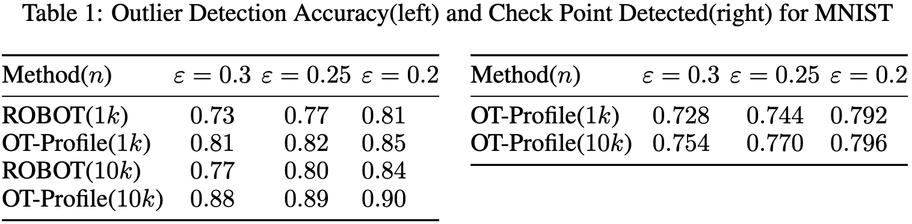

# Computing All Optimal Partial Transport

This repository contains the implementation of the paper :Computing All Optimal Partial Transports, which is available on [OpenReview](https://openreview.net/forum?id=gwcQajoXNF).

<!--  -->
<p align="center" width="100%">
     
</p>
In our experiments, we compared our algorithm to several other methods for outlier detection and PU-learning. The results are summarized in Table 1 (OT-profile computation) and Table 2 (PU-learning accuracy rates) below:

### Outlier Detection
For outlier detection, we compare our results with [Mukherjee et al. (2021)](https://arxiv.org/abs/2012.07363), whose code was obtained from their Github repository https://github.com/debarghya-mukherjee/Robust-Optimal-Transport, and some of their code was adopted for our comparison. The scripts named "outlier_detect_minist.py" and "outlier_detect_sythetic.py" generate the performance comparison in table 1 of our paper, conducting outlier detection with MNIST and synthetic data, respectively.
<p align="center" width="100%">
     
</p>

### PU-learning

For PU-learning, using OT-profile, we can both identify the class prior $\hat{\pi}$ as well as generate a set of labels for the unlabelled data. Unlike other techniques, prior knowledge of the class prior is required. Our results are compared with [Chapel et al. (2020)](https://arxiv.org/abs/2002.08276), and we have used some of their code from https://github.com/lchapel/partial-GW-for-PU for our comparison. The notebook named "table2.ipynb" conducts the experiments of PU-learning and generates the performance results in table 2 of the paper.

<p align="center" width="100%">
     
</p>

## Environments

This code is written in Python 3 and relies on the following libraries:
```
numpy
scipy
pot
tensorflow
jpype
kneed
```

## Citation

If you find this work helpful for your research, please consider citing our paper:
```
@inproceedings{APhatak2023,
title = {Computing all Optimal Partial Transports},
author = {Abhijeet Phatak and Sharath Raghvendra and Chittaranjan Tripathy and Kaiyi Zhang},
year = {2023},
booktitle={International Conference on Learning Representations (ICLR)},
url={https://openreview.net/forum?id=gwcQajoXNF}
}
```